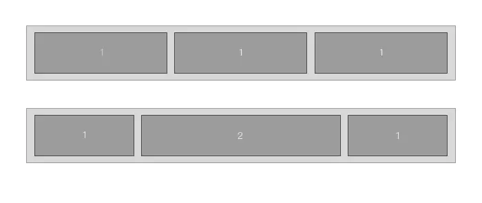

## 前言
后端写后端什么时候都是一件麻烦事,但是很多时候又没有前端来配合你,即便有blazor这种js解决方案,但是css还是必须由自己来写. 

在以前CSS布局大多由盒子模型来胜任,其精髓大抵为:
```css
//CSS
.box {
    height: 100px;
    width: 100px;
    margin: 20px;
    padding: 10px;
    border: 1px solid #000;
    background-color: #ccc;
}
```

   

> 当然不同的 display 属性下的盒模型是不一样的，上图为display:block情况下的盒模型，当在display:inline、display:table-cell等情况下需要另外考虑。 

在布局时,最烦人的莫过于居左居右居中,原因无他,实现方法太多,CSS的规则就是没有规则,在盒子模型的时候,大抵通过text-align和margin来设置.虽然现在的组件库大抵封装了Row和Col,但是这并不适用所有情况,而,再加上现在项目大抵都有响应式的需求,使得Flex(弹性布局)的地位更为突出.  

flex是css3加进来的东西,与传统布局对比,flex的兼容性较差,对IE的最低要求为IE 11(2022年了微软都放弃IE了不会有人还在坚持吧?).且在PC上的效果没有移动端好,但是其布局较为简单,快捷.并且原生支持响应式.

## 基础对比
设置了display:flex的元素称为弹性容器，它的所有子元素将称为flex item（弹性项目）。 
注意：设置了 flex 布局以后，子元素的float、clear和vertical-align属性将失效.  
如果父元素设置flex的话,普通行内元素(<span>)将可以设置宽高.  
  

- main axis：水平轴主轴
- cross axis：垂直交叉轴
- main start：主轴的开始位置
- main end：主轴的结束位置
- cross start：交叉轴的开始位置
- cross end：交叉轴的结束位置
- main size：单个弹性项目占据的主轴
- cross size：单个弹性项目占据的交叉轴

### 容器的属性
- flex-direction - 主轴的方向
- flex-wrap - 换行方式
- flex-flow - direction和wrap的简写
- justify-content - 主轴对齐方式
- align-items - 交叉轴对齐方式
- align-content - 多根轴线对齐方式

#### flex-direction
它决定了主轴的方向，就是弹性项目的方向 
```css
.box {
    flex-direction: row | row-reverse | column | column-reverse;
}
```
  

#### flex-wrap
```css
.box {
    flex-wrap: nowrap | wrap | wrap-reverse;
}
```
  

#### flex-flow
它是flex-direction和flex-wrap的简写，默认值为：row nowrap
```css
.box {
  flex-flow: <flex-direction> || <flex-wrap>;
}
```
#### justify-content
它来设置项目在主轴(默认是水平方向)上的对齐方式
```css
.box {
    justify-content: flex-start | flex-end | center | space-between | space-around;
}
```
  

#### align-items
它来设置项目在交叉(默认是垂直方向)轴上的对齐方式
```css
.box {
    align-items: flex-start | flex-end | center | baseline | stretch;
}
```
  
> baseline 是文字在同一水平线上:  
  
  

#### align-content
它定义了多根轴线的对齐方式。如果项目只有一根轴线，该属性不起作用。
```css
.box {
  align-content: flex-start | flex-end | center | space-between | space-around | stretch;
}
```
***注意,在flex中没有justify-items这个属性,它是盒子模型中的属性***

***

### align-items和align-content区别

align-items : 属性定义flex子项在flex容器的当前行的侧轴（纵轴）方向上的对齐方式。

center：元素位于容器的中心。
弹性盒子元素在该行的侧轴（纵轴）上居中放置。（如果该行的尺寸小于弹性盒子元素的尺寸，则会向两个方向溢出相同的长度）。
align-items:center

  

align-content：会设置自由盒内部所有行作为一个整体在垂直方向排列方式。针对多行作为一个整体在纵轴上的排列方式，该属性对单行无效。

center：元素位于容器的中心。
各行向弹性盒容器的中间位置堆叠。各行两两紧靠住同时在弹性盒容器中居中对齐，保持弹性盒容器的侧轴起始内容边界和第一行之间的距离与该容器的侧轴结束内容边界与第最后一行之间的距离相等。（如果剩下的空间是负数，则各行会向两个方向溢出的相等距离。）
容器内必须有多行的项目，该属性才能渲染出效果。
  
简而言之,一个对应每一项,一个对应整体. 

***

### 弹性项目的属性

- order - 排序顺序
- flex-grow - 放大比例
- flex-shrink - 缩小比例
- flex-basis - 理想空间
- flex -grow,-shrink和-basis的简写
- align-self - 单个项目对齐方式

#### order

```css
它是用来定义项目的排列顺序，数字越小，排列靠前，默认为0。
.item {
  order: 1;
}
```
  

#### flex-grow
这个属性是用来设置项目的空间占比比例，默认为0，即如果存在剩余空间也不占用；如果说有的项目的flex-grow属性都为1，那么它们会均分剩余的空间，如果一个项目的flex-grow属性为2，其他项目都为1，则为2的占据的剩余空间将比其他项多一倍。
```css
.item {
  flex-grow: 1;
}
```
  

#### flex-shrink
这个属性是用来设置项目的缩小比例，默认1，如果空间不足，则该项目缩小；如果一个项目的flex-shrink的属性为0，其它为1，则空间不足时，前者不缩小。
```
.item {
  flex-shrink: 1;
}
```
  

#### flex-basis 
flex-basis表示在flex items 被放入flex容器之前的大小，也就是items的理想或者假设大小，但是并不是其真实大小，其真实大小取决于flex容器的宽度.  
当flex-basis和width属性同时存在时，width属性不生效，flex item的宽度为flex-basis设置的宽度  
当flex空间不够时，由于flex-shrink的默认值为1，所以所有flex items容器等比例被压缩
```css
.item {
  flex-basis: 200px;
}
```

#### flex
它是属性flex-grow、flex-shrink和flex-basis的简写，默认值为0 1 auto，后两个属性为可选项。
```css
.item {
  flex: none | [ <'flex-grow'> <'flex-shrink'>? || <'flex-basis'> ];
}
```
### align-self
它是用来设置单个项目的在交叉轴上的对齐方式，它会覆盖align-items属性的值，默认值为auto，即继承了父级元素的align-items属性。
```css
.item {
  align-self: auto | flex-start | flex-end | center | baseline | stretch;
}
```
  

***仍然没有justify-self这个属性***

## 引用
- [CSS 盒模型 vs Flex 布局](https://www.jianshu.com/p/8c4cddb1b3c8)
- [flex布局与传统布局对比](https://juejin.cn/post/6968365405257596958)