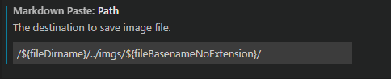

## hello world
如你所见,我清空了原有blog,似乎是种轮回,每隔那么久,几乎避免的会丢失一部分痕迹.要说直接原因,之前腾讯云的备份脚本不知道什么时候挂了,导致从年初开始一些文章都没有备份,结果就是我在换数据库的时候大手一按直接格式化.  
再就是typecho的1.2版本更新带来的大量插件兼容问题,而使用的原有material主题作者已经不再维护,主题后台管理也出现了部分bug,虽然可以自行修复,但是实在不想再去研究php,material主题作者博客也切换到了hexo,我虽然早也有此想法,但是惰性和时间导致一直拖延到如今,再加上我和他一样,非常不喜欢无后端环境,也只怪typecho耗尽了最后一丝热情.  
半个月前就开始琢磨迁移,但是直到最近才敲定,由于审美不太行,之前那个material风格的hexo版也已经停更两三年了,不得以采用了目前的Butterfly.虽然Butterfly非常不错,但是其本身的风格我是不太喜欢的,但是其它的就更不符合我审美了...

## 编写环境
Hexo的安装和其它配置没什么好说的,这些网上配置一大堆,不过值得说道的是本地编写中的VS Code部分,MarkDown支持的话VS Code默认就已经足够优秀,不过我依然安装了`GitHub Markdown Preview`和`Markdown All in One`,前者的话只是为了让自带的预览变成Github风格看起来更舒服些,后者则是为了某些环境需要导出md文件为html或者pdf,快捷键倒是其次.
### 插入图片
很难想象hexo版本迭代那么多次,默认的图片支持依然如此丑陋,3.0之前甚至必须得用异类标签引用
```base



```
而Hexo 3.0虽然解决了这点,解决方式是开启配置文件中的post_asset_folder
``` yml
post_asset_folder: true
marked:
  prependRoot: true
  postAsset: true
```
这开启之后每次Hexo New都会生成一个同名文件夹,可以把图片丢这里面引用,然后在生成静态文件的时候渲染引擎会将md的图片url映射到指定路径,但问题在于,这样线上会生效,但是在本地编写的时候VS Code渲染没有路径映射,只能靠脑部,我尝试去手动配置本地的图片渲染路径,但是貌似还没有直接的配置项,当然甚至可以专门去编写个插件,但这也颇为麻烦,加上文章文件夹下还放着一堆图片文件夹,强迫症实在忍不了.  
为了解决这点,可以在VS Code中安装一个`Markdown Paste`插件,这可以将图片黏贴到md中并生成对应url,然后,在扩展设置中设置黏贴路径
  
我将其修改为文章上级的Imgs文件中,然后根据文章文件名建立文件夹.然后再在hexo的配置文件中关闭上文提到的post_asset_folder,但是另外两项仍然需要保持开启(映射url):
``` yml
post_asset_folder: false
marked:
  prependRoot: true
  postAsset: true
```
这个时候,VS Code的本地渲染是正常的(如果不显示,可以把source文件夹打开为工作区,VS Code的安全策略会阻止读取父路径文件),渲染的静态文件也是正常的.按Ctrl+Alt+V(Windows)可以直接黏贴图片.
## 评论插件
目前采用的评论插件是Waline,除去国外哪些不符合使用习惯和审美的,比如来必力和FaceBook Comment之类,大致就Waline/valine、gitalk这两类,至于托管其它服务商的那种我不太信任,文章可靠的同时也要保证评论不丢失,再加上这种大多缺少可自定义性.  
gitalk这种插件最大的问题在于托管到Github的话指不定什么时候"被抽风",国内这种错综复杂的网络环境一言难尽,然后每篇文章都需要去初始化,虽然写完之后是顺手的事,不过仍然难为我这种懒人.
Waline虽然还有一些小问题,比如CloudBase托管暂时有Bug之类的,不过无伤大雅,国内访问速度暂时还行,后期看看能不能弄个反代加速之类的.

## 自动构建

由于托管在Github Page,就可以用超棒的Github Actions代替我们去Hexo g和git push.
这里我将hexo分支作为page根路径,在hexo下的.github\workflows文件夹里创建一个deploy.yml,并写入自动构建配置项
```yml
name: Hexo Deployment

on:
  push:
    branches:
      - main # only push events on source branch trigger deployment

jobs:
  hexo-deployment:
    runs-on: ubuntu-latest
    environment: Actions_Env
    env:
      TZ: Asia/Shanghai

    steps:
    - name: Checkout source
      uses: actions/checkout@v3
      with:
        submodules: true

    - name: Setup Node.js 16
      uses: actions/setup-node@v3
      with:
        node-version: 16

    - name: Install dependencies & Generate static files
      run: |
        node -v
        npm i hexo-cli -g
        npm i hexo-generator-search hexo-render-pug --save
        npm i
        hexo clean
        hexo g
        
    # Output to branch `static` from `master`
    - name: Deploy to GitHub Pages
      uses: peaceiris/actions-gh-pages@v3
      with:
        publish_dir: ./public
        publish_branch: hexo
        personal_token: ${{ secrets.GH_TOKEN }}
```
主分支(main或者master)和配置环境名需要自行更改,在Github的账号Setting中生成Token,然后在项目Setting--Environments配置即可.这样当你push新文章之后,GitHub Actions就会自动构建静态文件并提交到Hexo分支了.

---

之前那个typecho的文章应该会有一些搬过来,但是大部分应该都废弃了,初期在写博客的时候,纯粹当成了个学习C#的笔记,记了很多废话,这样只顾数量不顾质量的结果就是大部分文章都没啥价值,早该被丢在尘埃里,之前是想的也许以后能帮到别人,但其文章本身也写得远不如其它能随手百度到的内容,这种以后还是尽量避免,即浪费时间也没什么意义.  
后面如果有时间,希望能赶上以前的进度吧————这个有时间,对成年人而言太难了.